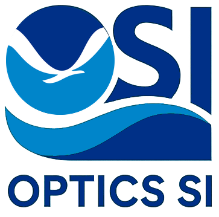
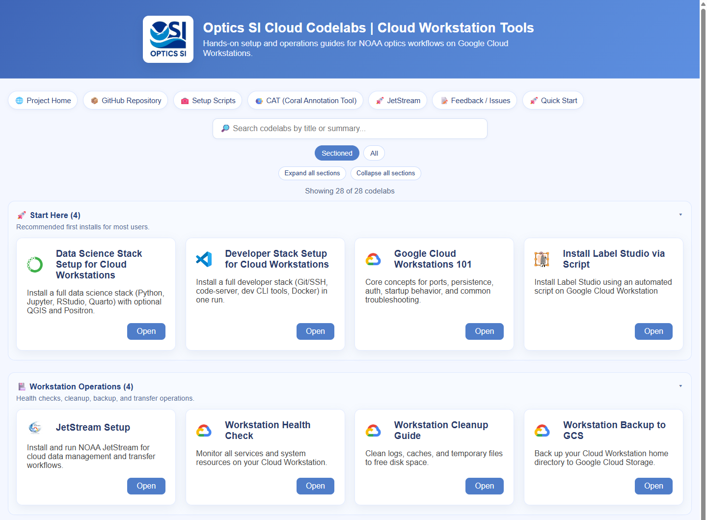
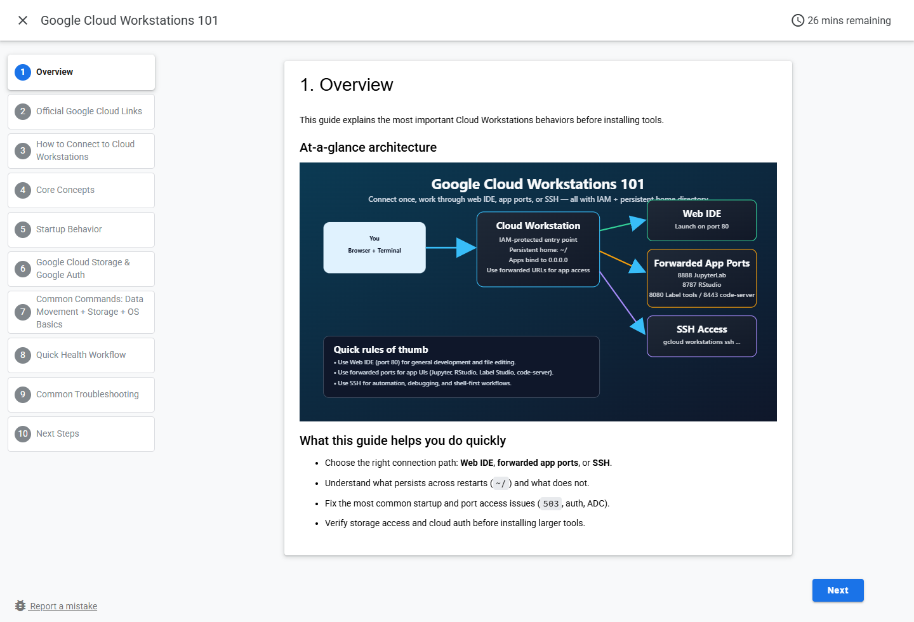
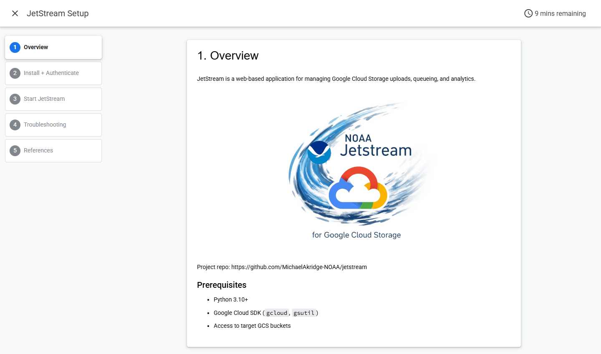

# Optics SI Cloud Tools

Optics SI cloud tools repository is to support data science workflows, cloud deployment, documentation, and reproducible research using cloud workstations and resources.

### Quick Start - Cloud Workstation Setup
- **[Visit this Link for the Full Setup Guides & Codelabs](https://michaelakridge-noaa.github.io/optics-si-cloud-tools/)**

### Screenshots

| View | Screenshot |
|---|---|
| Codelabs homepage |  |
| Google Cloud Workstations 101 codelab |  |
| JetStream Setup codelab |  |

### Main Folders
- **cloud/**: Cloud deployment resources (e.g., Terraform, AWS, Azure, GCP configs).
- **scripts/**: Setup scripts for Cloud Workstations ([see README](./scripts/README.md)).
- **notebooks/**: Jupyter notebooks for exploration, analysis, and prototyping.
- **documents/**: Project documentation, reports, and references.
- **data/**: Example datasets, data schemas, and data management scripts.
- **models/**: Pretrained models, model checkpoints, and training logs.
- **codelabs/**: Source markdown for step-by-step tutorials.
- **docs/**: GitHub Pages site with interactive codelabs.

----------
#### Disclaimer
This repository is a scientific product and is not official communication of the National Oceanic and Atmospheric Administration, or the United States Department of Commerce. All NOAA GitHub project content is provided on an ‘as is’ basis and the user assumes responsibility for its use. Any claims against the Department of Commerce or Department of Commerce bureaus stemming from the use of this GitHub project will be governed by all applicable Federal law. Any reference to specific commercial products, processes, or services by service mark, trademark, manufacturer, or otherwise, does not constitute or imply their endorsement, recommendation or favoring by the Department of Commerce. The Department of Commerce seal and logo, or the seal and logo of a DOC bureau, shall not be used in any manner to imply endorsement of any commercial product or activity by DOC or the United States Government.

#### License
- Details in the [LICENSE.md](./LICENSE.md) file.
