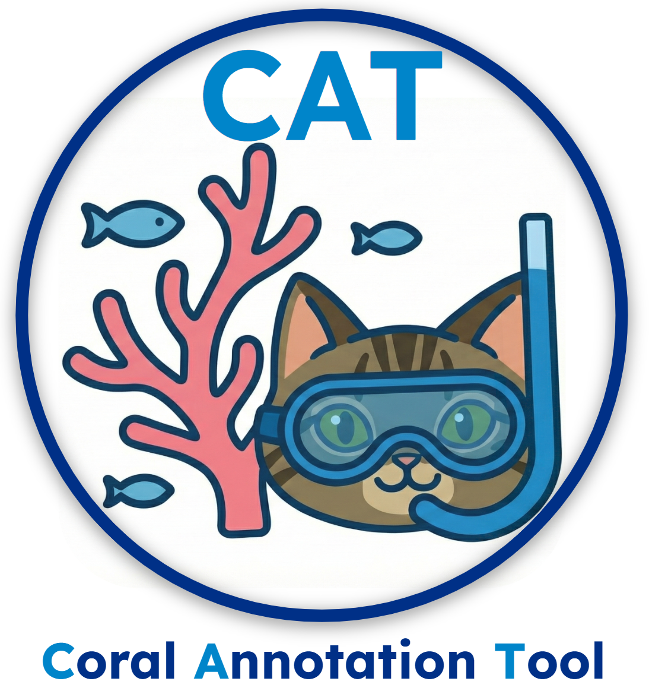

# CAT (Coral Annotation Tool) Setup
id: cat-install
title: CAT (Coral Annotation Tool) Setup
summary: Deploy CAT (cat_db_v2) on a Google Cloud Workstation with Docker and an Oracle database backend.
authors: Michael Akridge
categories: Annotation, Coral, Data Science
environments: Web
status: Published
tags: coral, annotation, cat, docker, oracle, geospatial, cloud-workstation
feedback link: https://github.com/MichaelAkridge-NOAA/optics-si-cloud-tools/issues

## Overview
Duration: 2

<a href="https://github.com/MichaelAkridge-NOAA/cat" target="_blank"></a>
CAT (Coral Annotation Tool) is an annotation and visualization platform for marine scientists working with Structure-from-Motion (SfM) orthomosaic imagery. The `cat_db_v2` branch adds an **Oracle database backend** for centralized project management, persistent annotations, overlay layer support, and multi-user workflows — all deployed via Docker Compose.

On first startup the system **auto-bootstraps**: Oracle init scripts create the schema, and the CAT app ingests reference data from CSVs — no manual DDL required.



Project repo (`cat_db_v2` branch): https://github.com/MichaelAkridge-NOAA/cat/tree/cat_db_v2

### Key Features
- **Oracle Database Backend** — Centralized project, annotation, and session storage
- **Auto-Bootstrap** — Schema and reference data created on first startup
- **Fast Tile Streaming** — Dynamic COG tile generation (Google Maps-style) for instant viewing
- **Shapefile Overlay Layers** — Import, edit, reorder, and style vector overlays per project
- **Species Database** — 1,000+ coral species with autocomplete
- **GeoJSON Export** — Export annotations in standard GeoJSON format
- **GCS Integration** — Native `gs://` bucket paths for COG imagery

### Prerequisites
- Google Cloud Workstation
- Docker & Docker Compose v2+ (installed by `install_cat.sh` if not present)
- Git
- `sudo` / root access

## Google Cloud Workstation Deployment (Automated)
Duration: 3

For a fully automated install that configures Docker, sets up systemd auto-start, and installs management scripts, run the one-line installer from the repo root:

```bash
# Clone the cat_db_v2 branch
git clone -b cat_db_v2 https://github.com/MichaelAkridge-NOAA/cat.git
cd cat
cp .env.example .env
nano .env   # change ORACLE_PASSWORD and APP_SCHEMA_PASSWORD
# Run the automated installer
sudo bash install_cat.sh
```

This script handles:
- Docker installation and configuration
- Environment file creation
- Docker Compose stack startup
- Systemd service registration for auto-start on reboot

On first startup:
1. Oracle Free initializes and runs `scripts/db-init/*.sql` (creates schema + tables)
2. CAT app waits for Oracle, verifies schema, and ingests reference CSVs
3. FastAPI server starts on port `8000`

### Verify & Access

> **Finding your Cloud Workstation URL:** In the [Google Cloud Workstations console](https://console.cloud.google.com/workstations), click **Open** next to your workstation. Your CAT URL will be:
> `https://8000-<your-workstation-id>.cloudworkstations.dev`

Open CAT in your browser:

```text
https://8000-<your-workstation-id>.cloudworkstations.dev
```

## Quick First Workflow
Duration: 3

1. Navigate to `https://8000-<your-workstation-id>.cloudworkstations.dev` and open the **Project Manager**
2. Click **Quick Create** in the Oracle Projects panel
3. Fill in: Project Name, Site, Island, Year, Cruise, Observer
4. Add COG TIF file paths (GCS `gs://` URLs)
5. Click **Create Project**, then **Open** to launch the annotation view
6. Draw polygons, lines, or points on the orthomosaic — annotations save to Oracle automatically
7. Export results as **GeoJSON** or **Shapefile** for use in ArcGIS/QGIS

## COG Conversion
Duration: 2

COG conversion happens automatically on first project load. You can also convert manually.

**Via Web Interface:**
1. Navigate to `https://8000-<your-workstation-id>.cloudworkstations.dev/converter`
2. Drag & drop GeoTIFF files
3. Select compression type (LZW, DEFLATE, or JPEG)
4. Click **Convert to COG**

**Via Command Line:**

```bash
# Single file
cat-convert input.tif output_cog.tif

# Batch conversion
cat-batch-convert input_folder/ output_folder/
```

## References
Duration: 1

- CAT repo (`cat_db_v2`): https://github.com/MichaelAkridge-NOAA/cat/tree/cat_db_v2
- Deployment plan: https://github.com/MichaelAkridge-NOAA/cat/blob/cat_db_v2/docs/DEPLOYMENT_PLAN.md
- CAT PyPI (file-based version): https://pypi.org/project/coral-annotation-tool
- Data Dictionary: https://www.fisheries.noaa.gov/inport/item/63239
- Metadata: https://www.fisheries.noaa.gov/inport/item/63097
