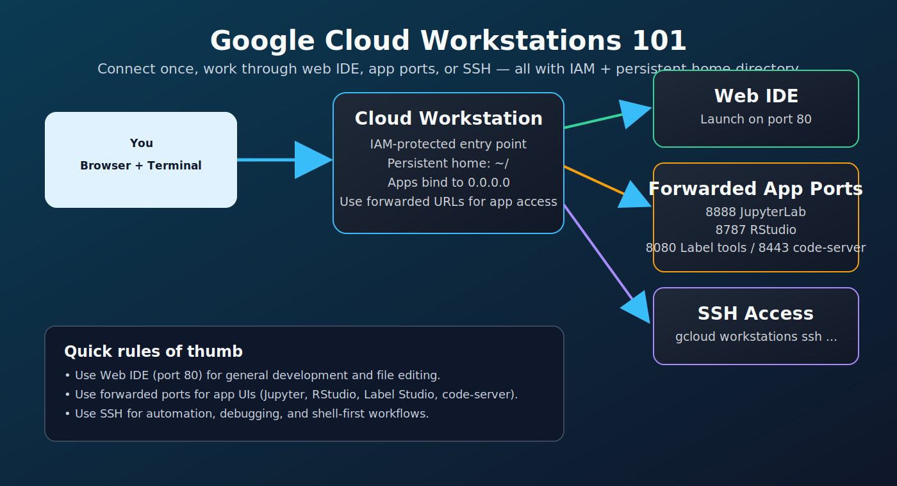

# Google Cloud Workstations 101
id: google-cloud-workstations-101
title: Google Cloud Workstations 101
summary: Core concepts for ports, persistence, auth, startup behavior, and common troubleshooting.
authors: Michael Akridge
categories: Cloud Workstation, Getting Started, Operations
environments: Web
status: Published
tags: cloud-workstations, ports, persistence, auth, troubleshooting
feedback link: https://github.com/MichaelAkridge-NOAA/optics-si-cloud-tools/issues

## Overview
Duration: 3

This guide explains the most important Cloud Workstations behaviors before installing tools.

### At-a-glance architecture



### What this guide helps you do quickly

- Choose the right connection path: **Web IDE**, **forwarded app ports**, or **SSH**.
- Understand what persists across restarts (`~/`) and what does not.
- Fix the most common startup and port access issues (`503`, auth, ADC).
- Verify storage access and cloud auth before installing larger tools.

## Official Google Cloud Links
Duration: 2

- Cloud Workstations docs: https://cloud.google.com/workstations/docs
- Connect to a workstation: https://cloud.google.com/workstations/docs/connect-to-workstation
- Port forwarding: https://cloud.google.com/workstations/docs/port-forwarding
- Manage configurations: https://cloud.google.com/workstations/docs/manage-configuration
- Troubleshooting: https://cloud.google.com/workstations/docs/troubleshooting
- Cloud Storage authentication: https://cloud.google.com/storage/docs/authentication

## How to Connect to Cloud Workstations
Duration: 4

### Option A: Connect from the Cloud console (recommended)

1. Open Cloud Workstations in Google Cloud Console.
2. Select your workstation.
3. Start it if needed.
4. Click **Launch** to open the web IDE.

### Option B: Connect with SSH

If you prefer terminal-only access, use the Google Cloud CLI.

General flow:

```bash
# 1) ensure gcloud is authenticated
gcloud auth login

# 2) start workstation (if stopped)
gcloud workstations start WORKSTATION_ID --region=REGION --cluster=CLUSTER_ID --config=CONFIG_ID

# 3) open SSH session
gcloud workstations ssh WORKSTATION_ID --region=REGION --cluster=CLUSTER_ID --config=CONFIG_ID
```

Use the official connect guide above for exact command variants in your environment.

### Option C: Connect to app ports (Jupyter, RStudio, Label Studio, etc.)

After launching the workstation, open the forwarded port URL from the Workstations UI.

- `8888` JupyterLab
- `8787` RStudio Server
- `8080` Label Studio / annotation tools
- `8443` code-server

If you get `503`, wait 30-120 seconds and check service status/logs.

### Console menu options explained

In the workstation menu, you may see options like these:

- **Start**  
	Starts the workstation VM/container if it is stopped.

- **Launch on port 80**  
	Opens the default workstation web IDE endpoint (port 80). Use this for normal IDE access.

- **Connect to web app on port...**  
	Lets you open a specific app port (for example `8888`, `8787`, `8080`, `8443`). Use this when your app is already running.

- **Port forwarding...**  
	Shows/manages forwarded ports and links. Useful when you need to discover URLs, verify mappings, or troubleshoot access.

- **Connect using SSH...**  
	Opens SSH access instructions/flow for terminal-based connection.

Rule of thumb:
- Use **Launch on port 80** for IDE work.
- Use **Connect to web app on port...** for app UIs.
- Use **SSH** for shell-first workflows, service debugging, and scripting.

## Core Concepts
Duration: 3

### 1) Authentication model
Cloud Workstations web access is protected by IAM. Most local services behind forwarded ports do not need separate external auth setup.

### 2) Persistence model
Only your home directory (`~/`) persists reliably across restarts. Install scripts in this repo store data/config in persistent paths.

### 3) Port forwarding model
Services should bind to `0.0.0.0` and then be accessed through Workstation forwarded URLs.

Common ports in this repo:
- `8080` Label Studio / annotation tools
- `8443` code-server
- `8787` RStudio Server
- `8888` JupyterLab

## Startup Behavior
Duration: 2

Some services autostart at boot; others are started on demand. If a port shows 503 immediately after restart, wait 30-120 seconds and check service status/logs.

## Google Cloud Storage & Google Auth
Duration: 2

### Google Cloud Storage (recommended: `gcloud storage`)

### Manual Google auth (if needed)

If auth is missing or expired, run:

```bash
# user auth for gcloud CLI
gcloud auth login --no-launch-browser

# application default credentials (used by SDKs/tools)
gcloud auth application-default login --no-launch-browser
```

### Quick verification

```bash
# verify auth and project context
gcloud auth list
gcloud config get-value project

# test GCS access
gcloud storage ls gs://YOUR-BUCKET/ | head
```
```bash
# list bucket contents
gcloud storage ls gs://YOUR-BUCKET/

# copy file to bucket
gcloud storage cp local_file.csv gs://YOUR-BUCKET/path/

# copy folder recursively
gcloud storage cp --recursive ~/data gs://YOUR-BUCKET/data/

# sync local folder -> bucket folder
gcloud storage rsync ~/data gs://YOUR-BUCKET/data --recursive
```

### `gsutil` equivalents (still widely used)

```bash
# list bucket
gsutil ls gs://YOUR-BUCKET/

# parallel copy (faster for many files)
gsutil -m cp -r ~/data gs://YOUR-BUCKET/

# sync local folder -> bucket folder
gsutil -m rsync -r ~/data gs://YOUR-BUCKET/data
```

If tools need Google Cloud APIs (`gs://`, storage SDKs, etc.), configure ADC:

```bash
curl -sL https://raw.githubusercontent.com/MichaelAkridge-NOAA/optics-si-cloud-tools/main/scripts/setup_gcloud_adc.sh | bash
```

For advanced scope needs, run `gcloud auth application-default login` with explicit scopes.

## Common Commands: Data Movement + Storage + OS Basics
Duration: 4

Use this as a practical command reference for daily workstation usage.

### Linux 101 (Quick Essentials)

If you're new to Linux, these are the most useful day-1 commands.

### Navigation + files

```bash
# where am I?
pwd

# list files
ls
ls -la

# change directory
cd ~/          # go to home
cd ..          # go up one folder

# create/remove folders
mkdir my_folder
rm -rf old_folder
```

### View + edit files

```bash
# print file contents
cat README.md

# view first/last lines
head -20 file.txt
tail -20 file.txt

# search inside files
grep -i "label" file.txt
```

### Download files

```bash
# download file
wget https://example.com/file.sh

# or with curl
curl -L -o file.sh https://example.com/file.sh
```

### Process/session basics

```bash
# show running processes
ps aux | head

# kill process by name
pkill -f jupyter

# use tmux for persistent terminal sessions
tmux new -s work
tmux attach -t work
```

### Zip and unzip

```bash
# zip a folder
zip -r archive.zip my_folder/

# unzip
unzip archive.zip
```

### Permissions and executable scripts

```bash
# make script executable
chmod +x script.sh

# run script
./script.sh
```

### Command history tips

```bash
# show command history
history

# show last 50 commands
history 50

# search command history
history | grep docker

# rerun previous command
!!

# rerun command by history number
!123
```

Optional: append history across sessions (add to `~/.bashrc`):

```bash
shopt -s histappend
PROMPT_COMMAND='history -a'
```

<aside class="positive">
Tip: If unsure what a command does, run `command --help` (example: `ls --help`).
</aside>

### Local file operations

```bash
# copy/move files
cp source.txt dest.txt
mv old_name.txt new_name.txt

# copy folders recursively
cp -r data/ backup_data/

# check sizes and free space
du -sh ~/data
df -h
```

### Compress / archive data

```bash
# create tar.gz archive
tar -czf dataset_backup.tar.gz ~/data

# extract archive
tar -xzf dataset_backup.tar.gz
```

## Quick Health Workflow
Duration: 2

```bash
workstation_health.sh
workstation_cleanup.sh --dry-run
workstation_backup.sh list gs://YOUR-BUCKET/PATH
```

## Common Troubleshooting
Duration: 3

### 503 on forwarded port
- Service may still be starting
- Verify process/status commands
- Check service logs

### GCS access fails
- Confirm ADC setup
- Confirm bucket IAM permissions
- Re-auth if tokens expired

### Service works after SSH only
- Check autostart method and restart scripts

## Next Steps
Duration: 1

- Run Data Science Stack or Dev Stack codelab
- Configure ADC if using cloud data
- Add backup + health checks for long-running environments
