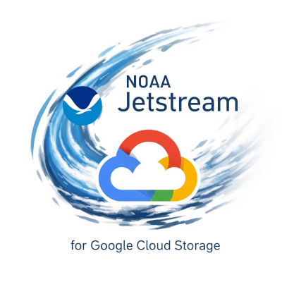

# JetStream Setup
id: jetstream-setup
title: JetStream Setup
summary: Install and run NOAA JetStream for cloud data management and transfer workflows.
authors: Michael Akridge
categories: Data Management, Cloud, Dashboard
environments: Web
status: Published
tags: jetstream, gcs, transfers, dashboard, cloud
feedback link: https://github.com/MichaelAkridge-NOAA/optics-si-cloud-tools/issues

## Overview
Duration: 2

JetStream is a web-based application for managing Google Cloud Storage uploads, queueing, and analytics.



Project repo: https://github.com/MichaelAkridge-NOAA/jetstream

### Prerequisites
- Python 3.10+
- Google Cloud SDK (`gcloud`, `gsutil`)
- Access to target GCS buckets

## Install + Authenticate
Duration: 3

```bash
pip install noaa-jetstream

gcloud auth login --no-launch-browser
gcloud auth application-default login --no-launch-browser
```

Optional checks:

```bash
gsutil ls
gcloud auth list
```

## Start JetStream
Duration: 1

```bash
jetstream
```

Open:

```text
http://localhost:8000
```

## Troubleshooting
Duration: 2

If server starts but UI does not load:

```bash
python diagnose.py
python -m uvicorn jetstream_api.main:app --reload --log-level debug
```

For GCS auth issues:

```bash
gcloud auth list
gcloud auth application-default print-access-token >/dev/null && echo "ADC OK"
```

## References
Duration: 1

- JetStream repo: https://github.com/MichaelAkridge-NOAA/jetstream
