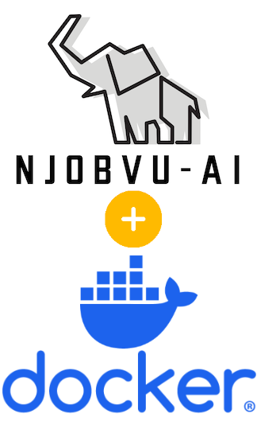

# Njobvu-AI Docker Setup
id: njobvu-ai-docker-setup
title: Njobvu-AI Docker Setup
summary: Run Njobvu-AI quickly using the prebuilt Docker image.
authors: Michael Akridge
categories: Annotation, Docker, Computer Vision
environments: Web
status: Published
tags: annotation, docker, cv, labeling, njobvu
feedback link: https://github.com/MichaelAkridge-NOAA/optics-si-cloud-tools/issues

## Overview
Duration: 1

This guide runs containerized Njobvu-AI using prebuilt Docker images.



Project repo: https://github.com/MichaelAkridge-NOAA/njobvu-ai-docker

### Prerequisites
- Docker installed and running

## Quick Start
Duration: 2

```bash
docker run -p 8080:8080 michaelakridge326/njobvu-ai
```

## Access the App
Duration: 1

Open:

```text
http://localhost:8080
```

For Cloud Workstations, use your forwarded port URL for `8080`.

## Optional: Run Detached
Duration: 1

```bash
docker run -d --name njobvu-ai -p 8080:8080 michaelakridge326/njobvu-ai
```

View logs:

```bash
docker logs -f njobvu-ai
```

Stop/remove:

```bash
docker stop njobvu-ai && docker rm njobvu-ai
```

## References
Duration: 1

- Repo: https://github.com/MichaelAkridge-NOAA/njobvu-ai-docker
- Docker Hub image: https://hub.docker.com/r/michaelakridge326/njobvu-ai
- GHCR package: https://github.com/MichaelAkridge-NOAA/njobvu-ai-docker/pkgs/container/njobvu-ai
- Upstream project: https://github.com/sullichrosu/Njobvu-AI
